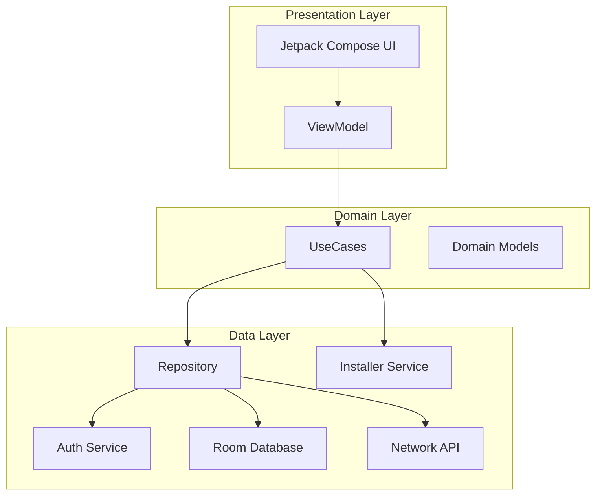

# App Store Architecture (Aurora-inspired)

This document outlines a modern, clean, and modular architecture for an Android app store, similar to Aurora Store but optimized for current best practices.

## Core Principles

- **Clean Architecture**: Separation of concerns into Data, Domain, and Presentation layers.
- **Unidirectional Data Flow (UDF)**: Ensuring predictable state management.
- **Modularization**: Decoupling features and core components for better maintainability and build times.
- **Reactive Programming**: Extensive use of Coroutines and Kotlin Flow.

## Tech Stack

- **UI**: Jetpack Compose
- **Dependency Injection**: Hilt
- **Async & Streams**: Kotlin Coroutines & Flow
- **Persistence**: Room Database, DataStore (for simple settings)
- **Network**: Retrofit / OkHttp
- **Background Tasks**: WorkManager
- **Image Loading**: Coil
- **Testing**: JUnit, MockK, Turbine (for Flow testing), Espresso / Compose Test Rule

## High-Level Architecture

The project is divided into several modules:

### 1. Presentation Layer (UI & ViewModels)

- **:ui-common**: Shared Compose components (stateless), themes (colors, typography), and UI utilities. **Must not** contain business logic or ViewModels.
- **:feature-home**: Main discovery screen, categorized app lists.
- **:feature-details**: Detailed app information, screenshots, reviews, and trackers.
- **:feature-search**: Search functionality and suggestions.
- **:feature-updates**: List of installed apps with available updates.
- **:feature-downloads**: Download manager UI. Observes download states from `:core-data`.
- **:feature-settings**: App configurations, account management, and spoofing.

### 2. Domain Layer (Business Logic)

- **:core-domain**: Definitions of models, UseCases (e.g., `GetAppDetailsUseCase`, `InstallAppUseCase`), and typed Error types (`AppException`). This layer is pure Kotlin/Java and contains no Android dependencies.

### 3. Data Layer (Implementation)

- **:core-data**: Repositories implementing Domain interfaces. Orchestrates data from local and remote sources. Owns the mapping between Data DTOs/Entities and Domain Models.
- **:core-network**: API clients and network models (DTOs).
- **:core-database**: Room DAO and Entity definitions.
- **:core-installer**: Abstractions and implementations for app installation (Session, Root, Shizuku).
- **:core-auth**: Management of Google/Anonymous accounts, token refreshing, and auth state (`Flow<AuthState>`).

### 4. Navigation

- **:core-navigation**: Defines the navigation contract, route classes (e.g., using Type-Safe Navigation), and deep link handling. Prevents feature modules from depending on each other.

## Component Interaction

## Data Flow (UDF)

1. **User Action**: User interacts with a Compose component (e.g., clicks "Install").
2. **ViewModel Event**: The UI notifies the ViewModel.
3. **UseCase Execution**: The ViewModel invokes a UseCase.
4. **Operation Coordination**: The UseCase coordinates between Repository (for metadata/URLs) and Installer (for the actual installation).
5. **State Update**: Data flows back as `Flow<AppResult<T>>`. The ViewModel transforms this into a UI State (StateFlow).
6. **UI Re-composition**: Compose observes the UI State and updates the interface.

## Error Handling

A sealed `AppResult` and `AppException` strategy is used in the Domain layer to ensure typed, predictable error handling across the app.

## App Installation Strategy

The `:core-installer` module provides a unified interface `AppInstaller`. Different implementations handle various environments:

- **SessionInstaller**: Uses Android's PackageInstaller (Standard/Native).
- **RootInstaller**: Uses su commands for silent installation.
- **ShizukuInstaller**: Leverages the Shizuku API for rootless silent installation.

## Background Operations

**WorkManager** is used for:
- Long-running downloads (managed by `:core-data`).
- Periodic update checks.
- Metadata caching.
