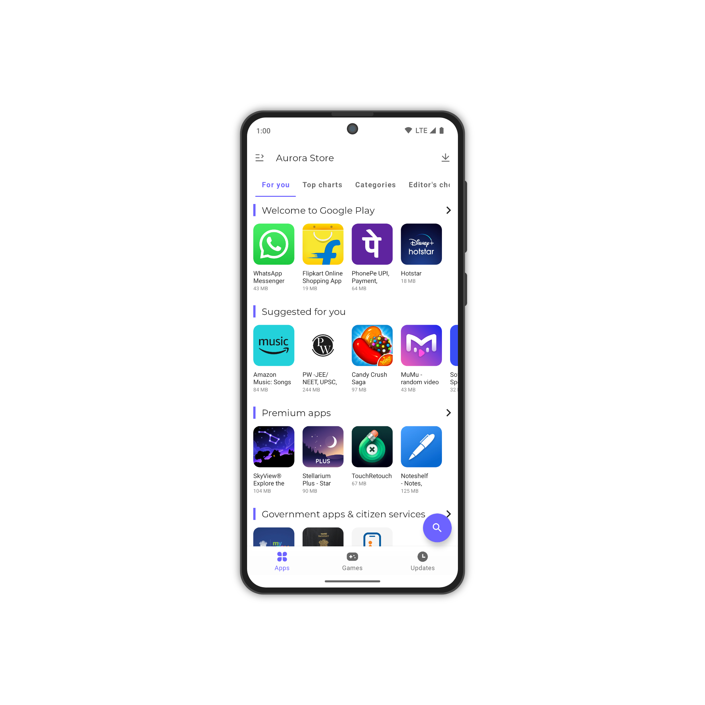
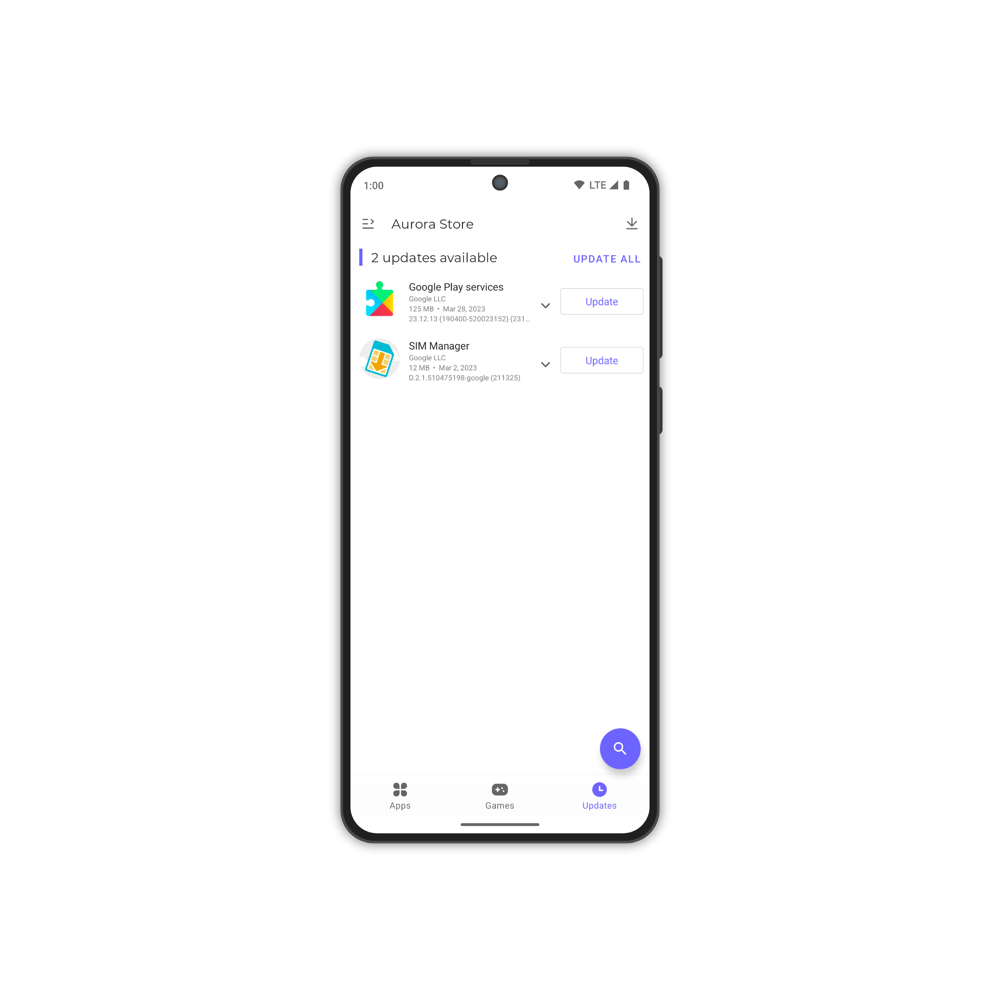
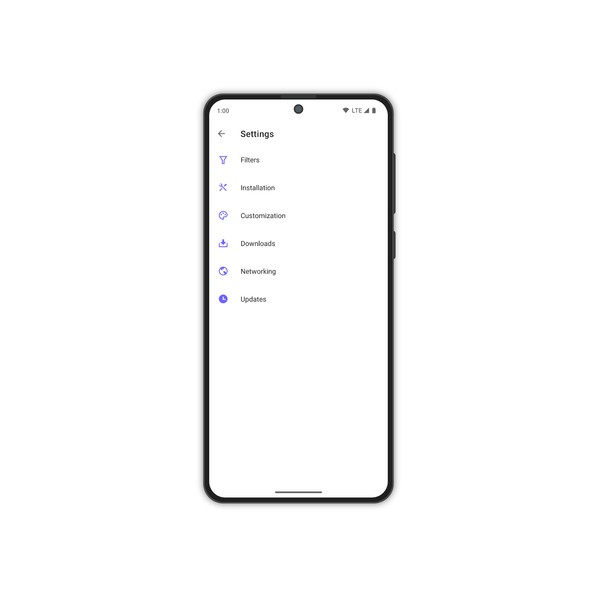
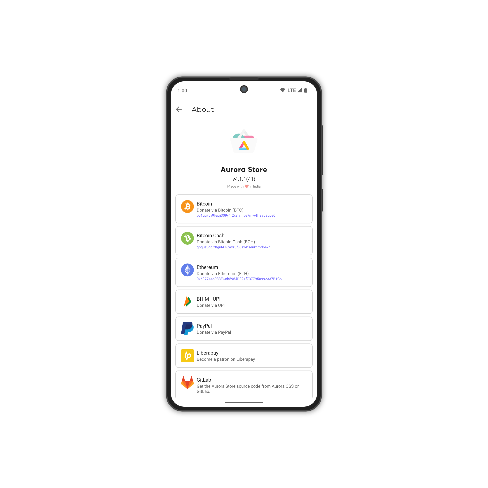

# Aurora Store

Aurora Store enables you to search and download apps from the official Google Play store. You can check app descriptions, screenshots, updates, reviews, and download the APK directly from Google Play to your device. 

To use Aurora Store, you need to have a Google Play account, and log in to your Google Play account when you first open and configure Aurora Store.
(Alternatively Aurora Store also allow you to login anonymously)

Unlike a traditional app store, Aurora Store does not own, license or distribute any apps. All the apps, app descriptions, screenshots and other content in Aurora Store are directly accessed, downloaded and/or displayed from Google Play. 

Aurora Store works exactly like a door or a browser, allowing you to log in to your Google Play account and find the apps from Google Play. 

*_Please note that Aurora Store does not have any approval, sponsorship or authorization from Google, Google Play, any apps downloaded through Aurora Store or any app developers; neither does Aurora Store have any affiliation, cooperation or connection with them._*

## Features

- FOSS: Has GPLv3 licence
- Beautiful design: Built upon latest Material 3 guidelines
- Account login: You can login with either personal or an anonymous account
- Device & Locale spoofing: Change your device and/or locale to access geo locked apps
- [Exodus Privacy](https://exodus-privacy.eu.org/) integration: Instantly see trackers in app
- Updates blacklisting: Ignore updates for specific apps
- Download manager
- Manual downloads: allows you to download older version of apps, provided
  - The APKs are available with Google
  - You know the version codes for older versions 

## Limitations

- Underlying API used is reversed engineered from PlayStore, changes on side may break it.
- Provides only base minimum features
  - Can not download or update paid apps.
  - Can not update apps/games with [Play Asset Delivery](https://developer.android.com/guide/playcore/asset-delivery)
- Multiple in-app features are not available if logged-in as Anonymous.
  - Library
  - Purchase History
  - Editor's Choise
  - Beta Programs
  - Review Add/Update
- Token Dispenser Server is not super reliable, downtimes are expected.  

## Downloads

Please only download the latest stable releases from one of these sources:

- [F-Droid](https://f-droid.org/en/packages/com.aurora.store/) (Recommended)
- [GitLab Releases](https://gitlab.com/AuroraOSS/AuroraStore/-/releases)

You can also get latest debug builds signed with AOSP test keys for testing latest changes from our [GitLab Package Registry](https://gitlab.com/AuroraOSS/AuroraStore/-/packages/24103616).

## Certificate Fingerprints

- SHA1: 94:42:75:D7:59:8B:C0:3E:48:85:06:06:42:25:A7:19:90:A2:22:02
- SHA256: 4C:62:61:57:AD:02:BD:A3:40:1A:72:63:55:5F:68:A7:96:63:FC:3E:13:A4:D4:36:9A:12:57:09:41:AA:28:0F

## Support

Aurora Store v4 is still in on-going development! Bugs are to be expected! Any bug reports are appreciated.
Please visit [Aurora Wiki](https://gitlab.com/AuroraOSS/AuroraStore/-/wikis/home) for FAQs.

- [Telegram](https://t.me/AuroraSupport)
- [XDA Developers](https://forum.xda-developers.com/t/app-5-0-aurora-store-open-source-google-play-client.3739733/)

## Permissions

- `android.permission.INTERNET` to download and install/update apps from the Google Play servers
- `android.permission.ACCESS_NETWORK_STATE` to check internet availability
- `android.permission.FOREGROUND_SERVICE` to download apps without interruption
- `android.permission.FOREGROUND_SERVICE_DATA_SYNC` to download apps without interruption
- `android.permission.REQUEST_IGNORE_BATTERY_OPTIMIZATIONS` to auto-update apps without interruption (optional)
- `android.permission.MANAGE_EXTERNAL_STORAGE` to access the OBB directory to download APK expansion files for games or large apps
- `android.permission.READ_EXTERNAL_STORAGE` to access the OBB directory to download APK expansion files for games or large apps
- `android.permission.WRITE_EXTERNAL_STORAGE` to access the OBB directory to download APK expansion files for games or large apps
- `android.permission.QUERY_ALL_PACKAGES` to check updates for all installed apps
- `android.permission.REQUEST_INSTALL_PACKAGES` to install and update apps
- `android.permission.REQUEST_DELETE_PACKAGES` to uninstall apps
- `android.permission.ENFORCE_UPDATE_OWNERSHIP` to silently update apps
- `android.permission.UPDATE_PACKAGES_WITHOUT_USER_ACTION` to silently update apps
- `android.permission.POST_NOTIFICATIONS` to notify user about ongoing downloads, available updates, and errors (optional)
- `android.permission.USE_CREDENTIALS` to allow users to sign into their personal Google account via microG

## Screenshots

## Translations

Don't see your preferred language? Click on the widget below to help translate Aurora Store!

## Donations

You can support Aurora Store's development financially via options below. For more options, checkout the **About** page within the Aurora Store.

## Project references

Aurora Store is based on these projects

- [YalpStore](https://github.com/yeriomin/YalpStore)
- [AppCrawler](https://github.com/Akdeniz/google-play-crawler)
- [Raccoon](https://github.com/onyxbits/raccoon4)
- [SAI](https://github.com/Aefyr/SAI)
