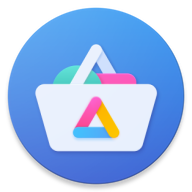
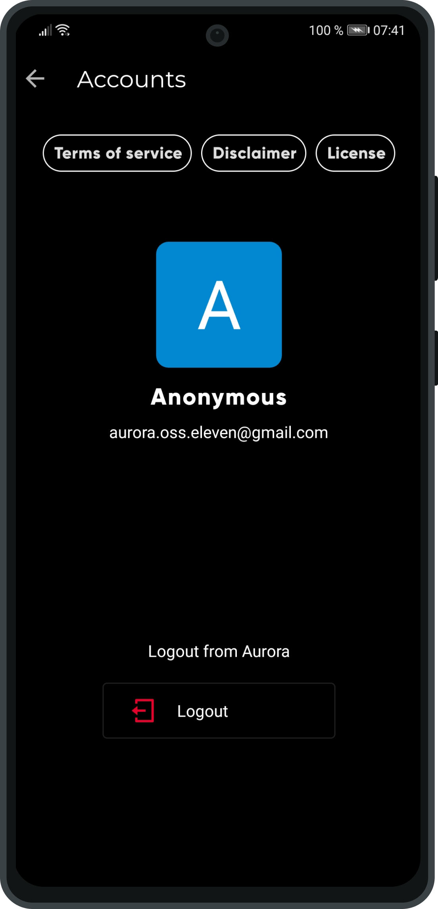
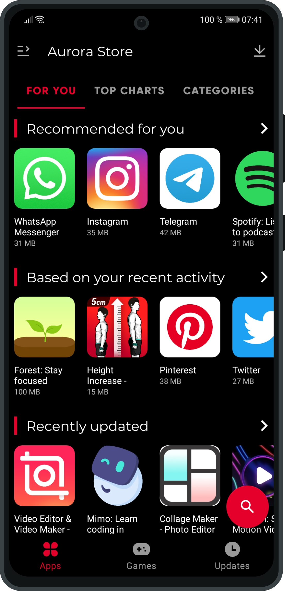
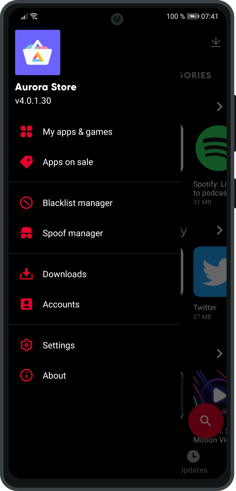
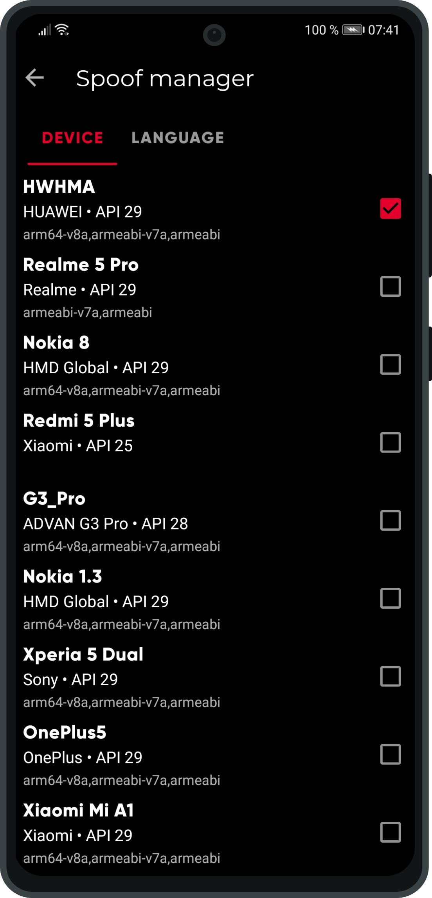

  

  

# Aurora Store: A Google Playstore Client

**Aurora Store** is an unofficial, FOSS client to Google's Play Store with an elegant design. Not only does Aurora Store download, update, and search for apps like the Play Store, it also empowers the user with new features.

For those concerned with privacy, **Aurora Store** does not require Google's proprietary framework (spyware?) to operate. It works perfectly fine with or without Google Play Services or [MicroG](https://microg.org/).

**Aurora Store** was originally based on Sergei Yeriomin's [Yalp store](https://github.com/yeriomin/YalpStore). **Aurora Store** v4.0 is a rewrite of version 3 in Kotlin that follows Material Design and runs on all devices running Android 4.4+. Read the roadmap page on our Wiki for more info!

## Screenshots

## Features

- Free/Libre software — Has GPLv3 licence
- Beautiful design — Built upon latest Material Design guidelines
- Anonymous accounts — You can log in and download with anonymous accounts so you don't have to use your own account
- Personal account login — You can download purchased apps or access your wishlist by using your own Google account
- [Exodus](https://exodus-privacy.eu.org/) integration — Instantly see trackers an app is hiding in its code

## Downloads

Please only download the latest stable releases from GitLab or one of these sources:

- GitLab: [Releases](https://gitlab.com/AuroraOSS/AuroraStore/-/releases)
- AuroraOSS: [Downloads](https://auroraoss.com/downloads/AuroraStore/)
- AuroraOSS: [Release](https://auroraoss.com/downloads/AuroraStore/Release/)
- F-Droid: [Link](https://f-droid.org/en/packages/com.aurora.store/)
- Telegram: [Channel](https://t.me/AuroraOfficial)
- XDA Forum: [Thread](https://forum.xda-developers.com/android/apps-games/galaxy-playstore-alternative-t3739733)

Nightlies are released here:

- AuroraOSS: [Nightlies](https://auroraoss.com/AuroraStore/Nightly/)

`Aurora Store v3 is still in development! Bugs are to be expected! Any bug reports are appreciated.`

## FAQ

Please visit the [GitLab Wiki](https://gitlab.com/AuroraOSS/AuroraStore/-/wikis/Home). You can also reach out to us on our support chat on [Telegram](https://t.me/AuroraSupport).

## Translations

Don't see your preffered language? Click on the widget below to help translate Aurora Store!

## Project references

Open Source libraries Aurora Store uses

- [RX-Java](https://github.com/ReactiveX/RxJava)
- [ButterKnife](https://github.com/JakeWharton/butterknife)
- [OkHttp3](https://square.github.io/okhttp/)
- [Glide](https://github.com/bumptech/glide)
- [Fetch2](https://github.com/tonyofrancis/Fetch)
- [GPlayApi](https://gitlab.com/AuroraOSS/gplayapi)
- [PlayStoreApi-v2](https://github.com/whyorean/playstore-api-v2) (Deprecated! Used up till v3)

Aurora Store is based on these projects

- [YalpStore](https://github.com/yeriomin/YalpStore)
- [AppCrawler](https://github.com/Akdeniz/google-play-crawler)
- [Raccoon](https://github.com/onyxbits/raccoon4)
- [SAI](https://github.com/Aefyr/SAI)

## Active Development on GitLab

The source code for Aurora Store is actively developed on GitLab. You can find the latest updates, contribute to development, and track the progress on the [Aurora Store GitLab repository](https://gitlab.com/AuroraOSS/AuroraStore).

