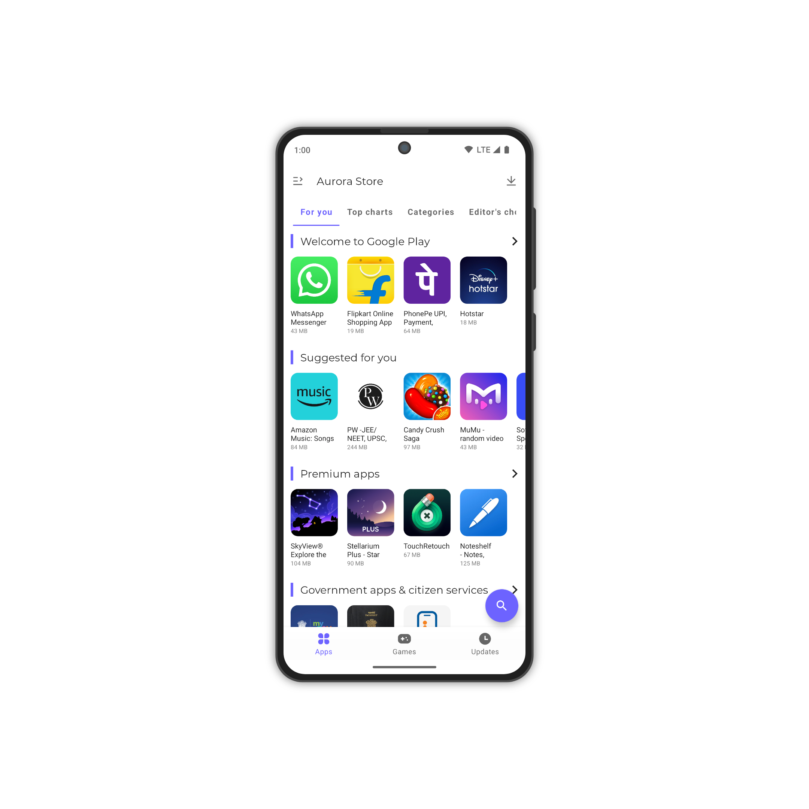
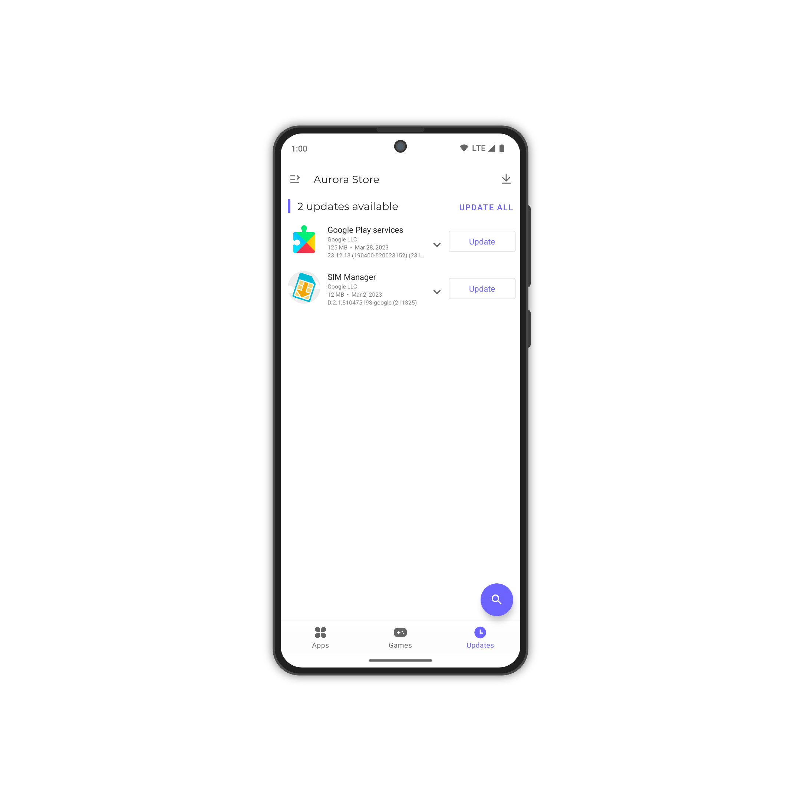
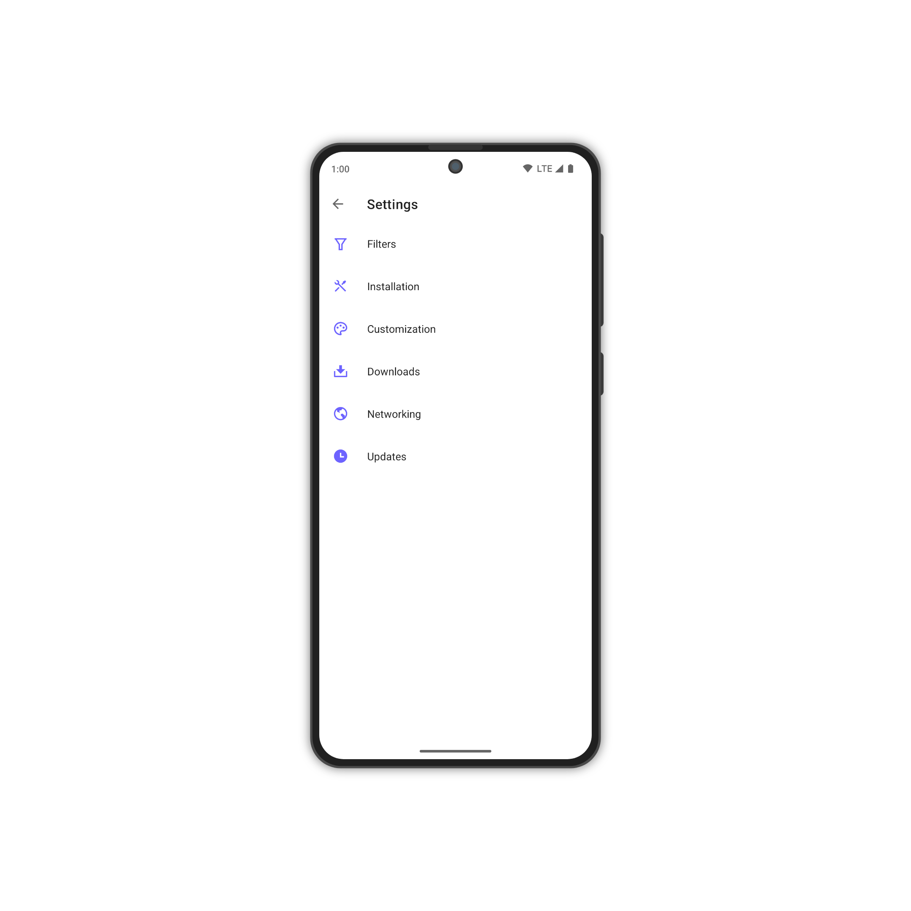
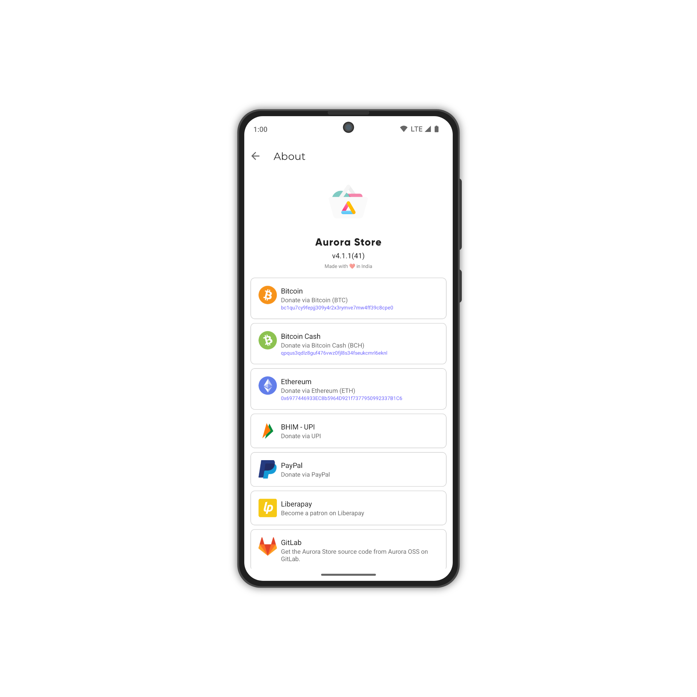

# Unofficial Aurora Store UI Fork

> This is an independent community fork of [Aurora Store](https://github.com/whyorean/AuroraStore), based on GPL-3.0-or-later source. The app UI and launcher artwork have been modified in this fork; these changes are dated 2026-09-28. See [LICENSE](LICENSE) and [patching/README.md](patching/README.md) for the license and reproducible source patch.
>
> This fork is not affiliated with or endorsed by Aurora OSS, Google, or Apple. Aurora Store and the original artwork identify the upstream project. The original project links and signing fingerprints below refer only to upstream Aurora Store, not builds from this fork. Fork builds, when published, will be listed in this repository's GitHub Releases.

## Upstream Aurora Store overview

Aurora Store enables you to search and download apps from the official Google Play store. You can check app descriptions, screenshots, updates, reviews, and download the APK directly from Google Play to your device. 

To use Aurora Store, log in using Google Play account, when you first open and configure Aurora Store.

Unlike a traditional app store, Aurora Store does not own, license or distribute any apps. All apps, app descriptions, screenshots and other content in Aurora Store are directly accessed, downloaded and/or displayed from Google Play. 

Aurora Store works exactly like a door or a browser, allowing you to log in to your Google Play account and find the apps from Google Play. 

*_Please note that Aurora Store does not have any approval, sponsorship or authorization from Google, Google Play, any apps downloaded through Aurora Store or any app developers; neither does Aurora Store have any affiliation, cooperation or connection with them._*

## Features

- FOSS: Has GPLv3 licence
- Beautiful design: Built upon latest Material 3 guidelines
- Account login: You can login with either personal or an anonymous account
- Device & Locale spoofing: Change your device and/or locale to access geo locked apps
- [Exodus Privacy](https://exodus-privacy.eu.org/) integration: Instantly see trackers in app
- [Plexus](https://plexus.techlore.tech/) integration: Instantly see app compatibility without Google Play Services or with microG
- Updates blacklisting: Ignore updates for specific apps
- Download manager
- Manual downloads: allows you to download older version of apps, provided
  - The APKs are available with Google
  - You know the version codes for older versions 

## Limitations

- The underlying API used is reversed engineered from the Google Play Store, changes on side may break it.
- Provides only base minimum features
  - Can not download or update paid apps.
  - Can not update apps/games with [Play Asset Delivery](https://developer.android.com/guide/playcore/asset-delivery)
- Multiple in-app features are not available if logged in as Anonymous.
  - Library
  - Purchase History
  - Editor's choice
  - Beta Programs
  - Review Add/Update
- Token dispenser server is not super reliable, downtimes are expected.  

## AI Usage

Aurora Store is developed with the help of AI tooling. Here is what that means.

**In this project**

- AI assistance is used in day to day development: writing and refactoring code,
  reviewing diffs, and drafting documentation.
- Nothing gets merged that a maintainer has not read, understood and tested.
  Generated code is a starting point, not a finished result.
- Accountability does not change. Whatever ships in Aurora Store is the
  maintainers' responsibility, no matter how it was written.

**In contributions**

- You are welcome to use AI tooling on your contributions. Just mention it in the
  merge request description.
- You are still responsible for what you send. Be ready to explain how your change
  works, and to show that you built and tested it yourself.
- Merge requests and issue reports that are plainly unreviewed model output (calls
  to APIs that do not exist, unrelated changes, made up bug reports) will be closed
  without review.

## Downloads

Please only download the latest stable releases from one of these sources:

- [Official website](https://auroraoss.com/)
- [GitLab Releases](https://gitlab.com/AuroraOSS/AuroraStore/-/releases)
- [IzzyOnDroid](https://apt.izzysoft.de/fdroid/index/apk/com.aurora.store) (reproducible)
- [F-Droid](https://f-droid.org/packages/com.aurora.store/) (signed by F-Droid, [more details](https://f-droid.org/docs/Signing_Process/))
- [App Gallery](https://appgallery.huawei.com/app/C110907863) (limited to certain countries)

You can also get latest debug builds signed with AOSP test keys for testing latest changes from our [GitLab Package Registry](https://gitlab.com/AuroraOSS/AuroraStore/-/packages/24103616).

## Certificate Fingerprints

- SHA1: 94:42:75:D7:59:8B:C0:3E:48:85:06:06:42:25:A7:19:90:A2:22:02
- SHA256: 4C:62:61:57:AD:02:BD:A3:40:1A:72:63:55:5F:68:A7:96:63:FC:3E:13:A4:D4:36:9A:12:57:09:41:AA:28:0F

## Support

Aurora Store v4 is still in on-going development! Bugs are to be expected! Any bug reports are appreciated.
Please visit [Aurora Wiki](https://gitlab.com/AuroraOSS/AuroraStore/-/wikis/home) for FAQs.

- [Telegram](https://t.me/AuroraSupport)
- [XDA Developers](https://forum.xda-developers.com/t/app-5-0-aurora-store-open-source-google-play-client.3739733/)

## Permissions

- `android.permission.INTERNET` to download and install/update apps from the Google Play servers
- `android.permission.ACCESS_NETWORK_STATE` to check internet availability
- `android.permission.FOREGROUND_SERVICE` to download apps without interruption
- `android.permission.FOREGROUND_SERVICE_DATA_SYNC` to download apps without interruption
- `android.permission.REQUEST_IGNORE_BATTERY_OPTIMIZATIONS` to auto-update apps without interruption (optional)
- `android.permission.MANAGE_EXTERNAL_STORAGE` to access the OBB directory to download APK expansion files for games or large apps
- `android.permission.READ_EXTERNAL_STORAGE` to access the OBB directory to download APK expansion files for games or large apps
- `android.permission.WRITE_EXTERNAL_STORAGE` to access the OBB directory to download APK expansion files for games or large apps
- `android.permission.QUERY_ALL_PACKAGES` to check updates for all installed apps
- `android.permission.REQUEST_INSTALL_PACKAGES` to install and update apps
- `android.permission.REQUEST_DELETE_PACKAGES` to uninstall apps
- `android.permission.ENFORCE_UPDATE_OWNERSHIP` to silently update apps
- `android.permission.UPDATE_PACKAGES_WITHOUT_USER_ACTION` to silently update apps
- `android.permission.POST_NOTIFICATIONS` to notify user about ongoing downloads, available updates, and errors (optional)
- `android.permission.USE_CREDENTIALS` to allow users to sign into their personal Google account via microG

## Screenshots

## Translations

Don't see your preferred language? Click on the widget below to help translate Aurora Store!

## Donations

You can support Aurora Store's development financially via options below. For more options, checkout the **About** page within the Aurora Store.

## Project references

Aurora Store is based on these projects

- [YalpStore](https://github.com/yeriomin/YalpStore)
- [AppCrawler](https://github.com/Akdeniz/google-play-crawler)
- [Raccoon](https://github.com/onyxbits/raccoon4)
- [SAI](https://github.com/Aefyr/SAI)
